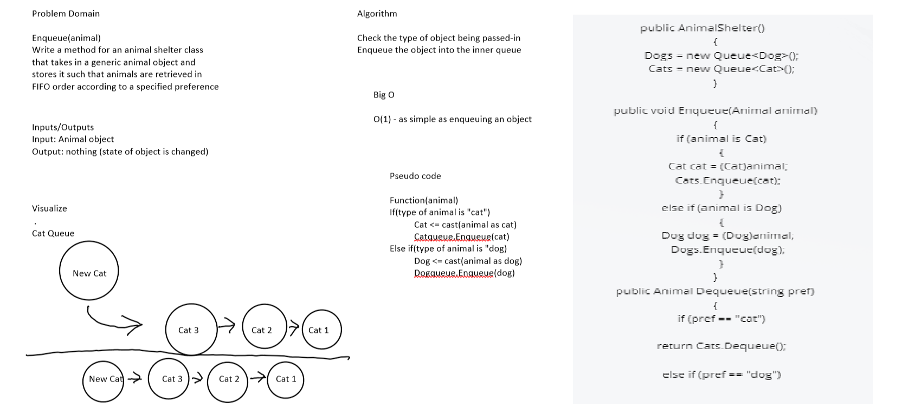

# Challenge Summary
A .NET Console App the implements a FIFO Animal Shelter. Allows getting the cat or dog that has been in the shelter the longest, or allows a client class to specify "no preference" in which case the animal that has been in the shelter the longest is returned.

- `Enqueue(Animal animal)` - stores any object, with FIFO ordering, that inherits from the abstract Animal class.
- `Dequeue(string pref)` - retrieves a Cat or a Dog object, or returns null, depending on the state of AnimalShelter.

## Whiteboard Process

## Approach & Efficiency
- `Enqueue(Animal animal)`
    - Time: O(1)
    - Space: O(1)
- `Dequeue(string pref)`
    - Time: O(1)
    - Space: O(1)

## Solution
```
public AnimalShelter()
        {
            Dogs = new Queue<Dog>();
            Cats = new Queue<Cat>();
        }

        public void Enqueue(Animal animal)
        {
            if (animal is Cat)
            {
                Cat cat = (Cat)animal;
                Cats.Enqueue(cat);
            }
            else if (animal is Dog)
            {
                Dog dog = (Dog)animal;
                Dogs.Enqueue(dog);
            }
        }
        public Animal Dequeue(string pref)
        {
            if (pref == "cat")
            
            return Cats.Dequeue();
            
            else if (pref == "dog")
            
            return Dogs.Dequeue();
            
            else
            
            return null;
        }

       
    }
}
```