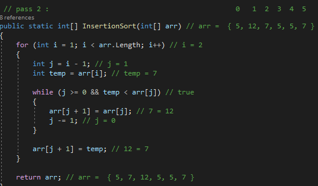
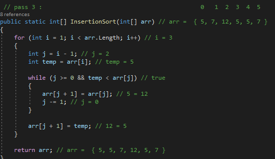

# Insertion Sort
Insertion sort is a simple sorting algorithm that works similar to the way you sort playing cards in your hands. The array is virtually split into a sorted and an unsorted part. Values from the unsorted part are picked and placed at the correct position in the sorted part.

## Pseudocode
```
InsertionSort(int[] arr)

    FOR i = 1 to arr.length

      int j <-- i - 1
      int temp <-- arr[i]

      WHILE j >= 0 AND temp < arr[j]
        arr[j + 1] <-- arr[j]
        j <-- j - 1

      arr[j + 1] <-- temp
```      

## Trace
Pass 1 :[ 5, 12, 7, 5, 5, 7 ]


In the first pass 5>12 => 5 is not greater than 12 so dont swap , we do not move the element 23 and the array stays in the same order.


Pass 2 :



In the second pass 12>7 => 12 is greater than 7 so swap 7 and 12 in the temp, then let the value of the second element in the first index, and finally let the second index = temp.


Pass 3 :



In the third pass 12>5 =>12 is greater than 5 so swap 5 and 12 in the temp, then let the value of the second element in the first index, and finally let the second index = temp.

Pass 4 :


In the fourth pass 12>5 =>12 is greater than 5 so swap 5 and 12 in the temp, then let the value of the second element in the first index, and finally let the second index = temp.

Pass 5 :


In the fifth pass 12>7 => 12 is greater than 7 so swap 7 and 12 in the temp, then let the value of the second element in the first index, and finally let the second index = temp.


## Efficiency
| | Time | Space |
|:-- | :----------- | :----------- |
| InsertionSort(int[] arr) | O(n^2) | O(1) |