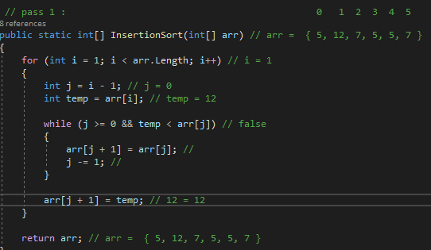
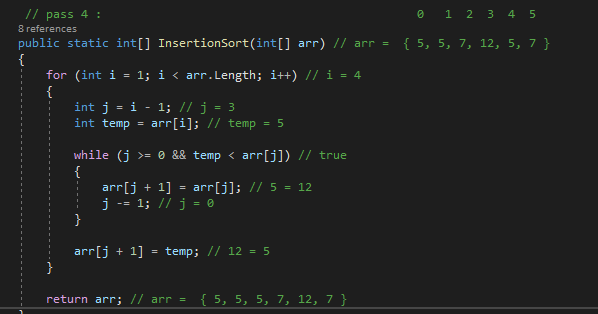

# Insertion Sort
Insertion sort is a simple sorting algorithm that works similar to the way you sort playing cards in your hands. The array is virtually split into a sorted and an unsorted part. Values from the unsorted part are picked and placed at the correct position in the sorted part.

## Pseudocode
```
InsertionSort(int[] arr)

    FOR i = 1 to arr.length

      int j <-- i - 1
      int temp <-- arr[i]

      WHILE j >= 0 AND temp < arr[j]
        arr[j + 1] <-- arr[j]
        j <-- j - 1

      arr[j + 1] <-- temp
```      

## Trace
Pass 1 :
arr  => [8,4,23,42,16,15]



In the first pass 8>4 => 8 is greater than 4 so swap 4 and 8 let 4 in the temp, then let the value of the second element in the first index, and finally let the second index = temp.


Pass 2 :


In the second pass 23>8 => 23 is greater than 8 so Don't swap , we do not move the element 23 and the array stays in the same order.


Pass 3 :


In the third pass 42>23 => 42 is greater than 23 so Don't swap , we do not move the element 42 and the array stays in the same order.

Pass 4 :



In the fourth pass 16<42&23 => 16 is smaller than 42,23 so insert the element 16 into the previous position until 16>8


Pass 5 :


In the fifth pass 15<42&23&16 => 15 is smaller than 42,23,16 so insert the element 15 into the previous position until 15>8

## Efficiency
| | Time | Space |
|:-- | :----------- | :----------- |
| InsertionSort(int[] arr) | O(n^2) | O(1) |