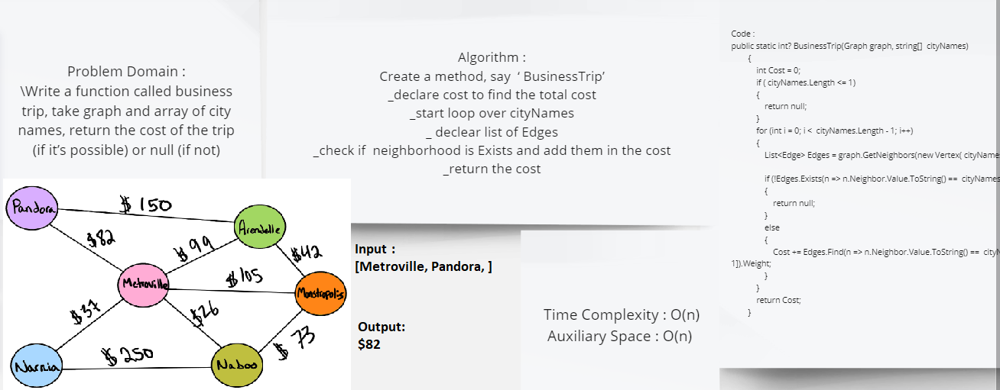

# Challenge Summary
Write a function called business trip, take graph and array of city names, return the cost of the trip (if it’s possible) or null (if not)


## Whiteboard Process



## Approach & Efficiency
* Time :O(N)
* Space :O(N)

## Solution
```C#
public static int? BusinessTrip(Graph graph, string[]  cityNames)
        {
            int Cost = 0;
            if ( cityNames.Length <= 1)
            {
                return null;
            }
            for (int i = 0; i <  cityNames.Length - 1; i++)
            {
                List<Edge> Edges = graph.GetNeighbors(new Vertex( cityNames[i]));

                if (!Edges.Exists(n => n.Neighbor.Value.ToString() ==  cityNames[i + 1]))
                {
                    return null;
                }
                else
                {
                    Cost += Edges.Find(n => n.Neighbor.Value.ToString() ==  cityNames[i + 1]).Weight;
                }
            }
            return Cost;
        }
```
