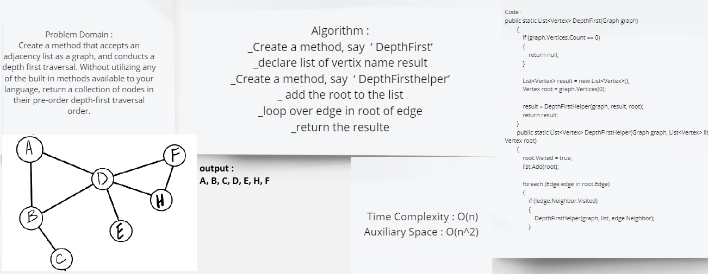

# Depth First Traversal
This app is able to take a graph and display a list of nodes collected by depth first, pre-order traversal from a starting root node.


## Challenge
Create a method that accepts an adjacency list as a graph, and conducts a depth first traversal. Without utilizing any of the built-in methods available to your language, return a collection of nodes in their pre-order depth-first traversal order.

## Whiteboard Process



## Approach & Efficiency
* Big O Space = O(n)
* Big O Time = O(n^2)

## Solution
```c#
public static List<Vertex> DepthFirst(Graph graph)
        {
            if (graph.Vertices.Count == 0)
            {
                return null;
            }

            List<Vertex> result = new List<Vertex>();
            Vertex root = graph.Vertices[0];

            result = DepthFirstHelper(graph, result, root);
            return result;
        }
        public static List<Vertex> DepthFirstHelper(Graph graph, List<Vertex> list, Vertex root)
        {
            root.Visited = true;
            list.Add(root);

            foreach (Edge edge in root.Edge)
            {
                if (!edge.Neighbor.Visited)
                {
                    DepthFirstHelper(graph, list, edge.Neighbor);
                }
            }

            return list;
        }
```
