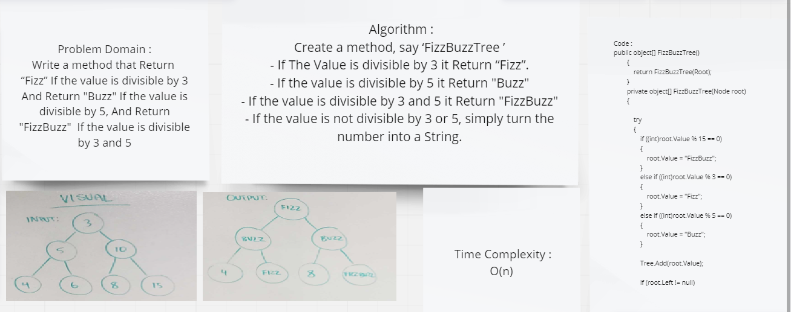

# FizzBuzzTree

## Challenge Summary
Write a method that Return  “Fizz” If the value is divisible by 3
And Return "Buzz" If the value is divisible by 5, And Return "FizzBuzz"  If the value is divisible by 3 and 5

## Whiteboard Process



## Approach & Efficiency
Time Complexity :
O(n)

## Solution
```
public object[] FizzBuzzTree()
        {
            return FizzBuzzTree(Root);
        }
        private object[] FizzBuzzTree(Node root)
        {

            try
            {
                if ((int)root.Value % 15 == 0)
                {
                    root.Value = "FizzBuzz";
                }
                else if ((int)root.Value % 3 == 0)
                {
                    root.Value = "Fizz";
                }
                else if ((int)root.Value % 5 == 0)
                {
                    root.Value = "Buzz";
                }

                Tree.Add(root.Value);

                if (root.Left != null)
                {
                    FizzBuzzTree(root.Left);
                }
                if (root.Right != null)
                {
                    FizzBuzzTree(root.Right);
                }
            }
            catch (Exception e)
            {
                Console.WriteLine(e.Message);
            }

            return Tree.ToArray();
        }
```        
