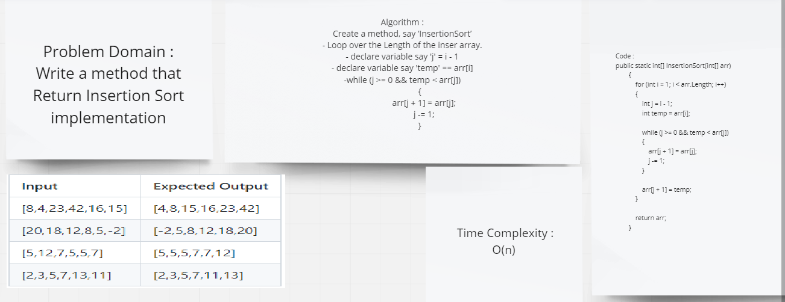

# Challenge Summary
 tested implementation of Insertion Sort based on the pseudocode provided.
 ```
  InsertionSort(int[] arr)

    FOR i = 1 to arr.length

      int j <-- i - 1
      int temp <-- arr[i]

      WHILE j >= 0 AND temp < arr[j]
        arr[j + 1] <-- arr[j]
        j <-- j - 1

      arr[j + 1] <-- temp

 ```

 ## Inputs and Expected Outputs
| Input | Expected Output |
| :----------- |:----------- |
| [8,4,23,42,16,15] | [4,8,15,16,23,42] |
| [20,18,12,8,5,-2] | [-2,5,8,12,18,20] |
| [5,12,7,5,5,7] | [5,5,5,7,7,12] |
| [2,3,5,7,13,11] | [2,3,5,7,11,13] |


## Whiteboard Process



## Approach & Efficiency
| | Time | Space |
|:-- | :----------- | :----------- |
| InsertionSort(int[] arr) | O(n^2) | O(1) |


## Solution
```
public static int[] InsertionSort(int[] arr)
        {
            for (int i = 1; i < arr.Length; i++)
            {
                int j = i - 1;
                int temp = arr[i];

                while (j >= 0 && temp < arr[j])
                {
                    arr[j + 1] = arr[j];
                    j -= 1;
                }

                arr[j + 1] = temp;
            }

            return arr;
        }
```