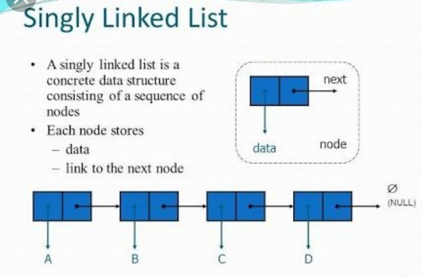

# Singly Linked List



## Challenge
* Create a Node class that has properties for the value stored in the Node, and a pointer to the next Node
* Create Linked List class
* Create insert function to insert data in node in linked list
* Create include function to search about data in linked list
* Create toString function to return string


## Approach & Efficiency
Big o -> O(1) for all functions


## API
`insert` -> to insert data into node in linked list.

`include` -> search about data into linked list.

`Tostring` -> Returns: a string representing all the values in the Linked List, formatted as:
```
"[ a ] -> [ b ] -> [ c ] -> NULL"
```

# Linked Test

- [x] Test instantiate an empty linked list
- [x] Test for insert into the linked list
- [x] Test the head property will properly point to the first node in the linked list
- [x] Tset if can properly insert multiple nodes into the linked list
- [x] Test to return true when finding a value within the linked list that exists
- [x] Test to return false when searching for a value in the linked list that does not exist
- [x] Test to return a collection of all the values that exist in the linked list


