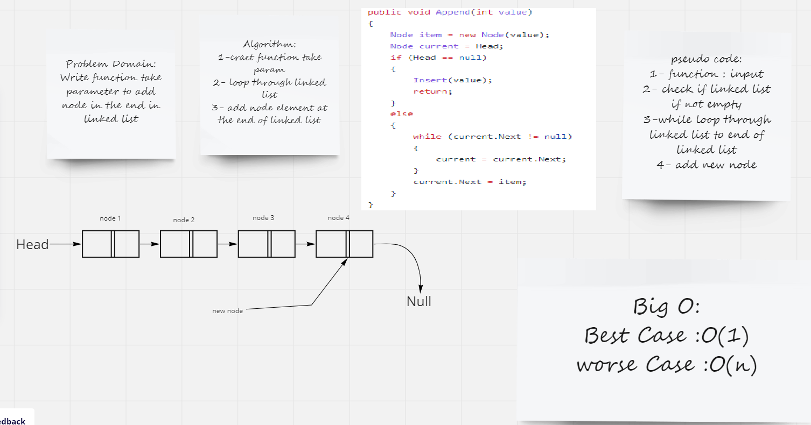

# Singly Linked List


## Challenge
* Create a Node class that has properties for the value stored in the Node, and a pointer to the next Node
* Create Linked List class
* Create insert function to insert data in node in linked list
* Create include function to search about data in linked list
* Create toString function to return string
* Create append function to Add in the end
* Create insertBefore function to Add before specified value
* Create insertAfter function to Add After specified value
* Create kthFromEnd function to Return the node’s value that is `k`places from the tail of the linked list.
* create ziplist function to return two LinkList  

## Approach & Efficiency
Big o -> O(1) for all functions


## API
`insert` -> to insert data into node in linked list.

`include` -> search about data into linked list.

`Tostring` -> Returns: a string representing all the values in the Linked List, formatted as:

```
"[ a ] -> [ b ] -> [ c ] -> NULL"
```
`append` -> dds a new node with the given value to the end of the list



`insertBefore` -> adds a new node with the given new value immediately before the first node that has the value specified


`insertAfter` -> adds a new node with the given new value immediately before the first node that has the value specified


`kthFromEnd` -> Return the node’s value that is `k`places from the tail of the linked list.


`ZipLists`-> Return two linklist and output in new linklist


# Linked Test

- [x] Test instantiate an empty linked list
- [x] Test for insert into the linked list
- [x] Test the head property will properly point to the first node in the linked list
- [x] Tset if can properly insert multiple nodes into the linked list
- [x] Test to return true when finding a value within the linked list that exists
- [x] Test to return false when searching for a value in the linked list that does not exist
- [x] Test to return a collection of all the values that exist in the linked list
- [x] Can successfully add a node to the end of the linked list
- [x] Can successfully add multiple nodes to the end of a linked list
- [x] Can successfully insert a node before a node located i the middle of a linked list
- [x] Can successfully insert a node before the first node of a linked list
- [x] Can successfully insert after a node in the middle of the linked list
- [x] Can successfully insert a node after the last node of the linked list
- [x] Where k is greater than the length of the linked list
- [x] Where k and the length of the list are the same
- [x] Where k is not a positive integer
- [x] Where the linked list is of a size 1
- [x] “Happy Path” where k is not at the end, but somewhere in the middle of the linked list
- [x] Can successfully to merge Two LinkList with same length 
- [x] Can successfully to merge Two LinkList with Defrent lenght 


