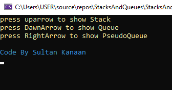
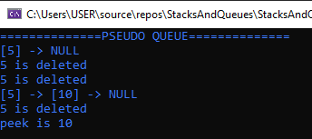

# Stack Queue Pseudo

## Problem Domain
Create a brand new PseudoQueue class. Do not use an existing Queue. Instead, this PseudoQueue class will implement our standard queue interface (the two methods listed below), but will internally only utilize 2 Stack objects. Ensure that you create your class with the following methods:
- enqueue(value) which inserts value into the PseudoQueue, using a first-in, first-out approach.
- dequeue() which extracts a value from the PseudoQueue, using a first-in, first-out approach.
The Stack instances have only push, pop, and peek methods. You should use your own Stack implementation. Instantiate these Stack objects in your PseudoQueue constructor.

Enqueue(value)
| Input | Arguments | Expected Output |
| :----------- | :----------- |:----------- |
| [10]->[15]->[20] | 5 | [5]->[10]->[15]->[20]|
|  | 5  | [5] |

Dequeue()
| Input | Output | Internal State |
| :----------- | :----------- |:----------- |
| [5]->[10]->[15]->[20] | 20 | [5]->[10]->[15]|
| [5]->[10]->[15] | 15 | [5]->[10]|

## visual

And after you Click `RightArrow`

## Approach & Efficiency
* Enqueue() - Big O Time = O(1), Space = O(1): This approach uses just a simple push() call to imitate an Enqueue(), thus no node traversal is need and Big O time and space is O(1).

* Dequeue() - Big O Time = O(n), Space = O(n): For Dequeue(), temporary stacks are used to move, flip, and reassign the stack minus the dequeued node, using while loops and pop() to transfer nodes to each stack, then using a temp integer to store and return the dequeued node's value
