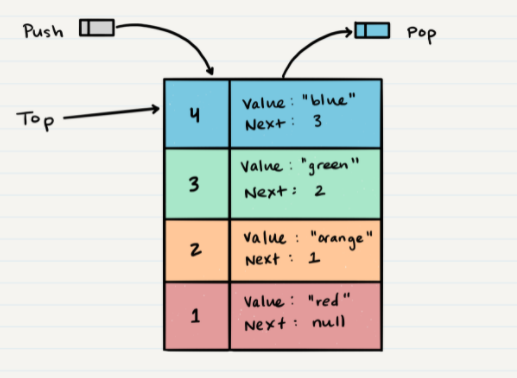
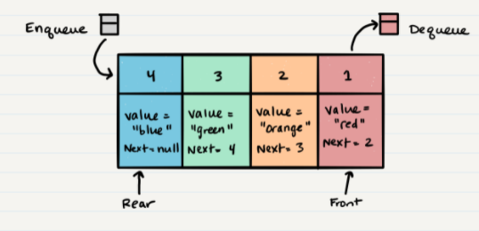
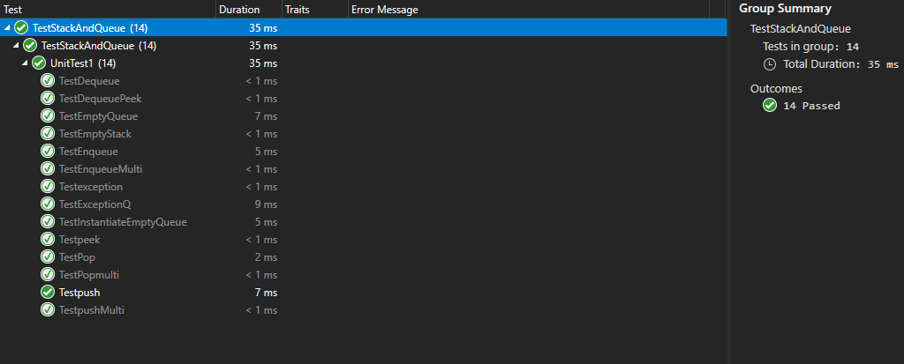

# Stacks and Queues
>Stacks

>Queues

## Challenge :

* Create a Node class that has properties for the value stored in the Node, and a pointer to the next node.
* Create a Stack class that has a top property. It creates an empty Stack when instantiated.
* Create a Queue class that has a front property. It creates an empty Queue when instantiated.

## Approach & Efficiency :

Big o -> O(1) for all functions

## API :
> Stack

`push` -> adds a new node with that value to the `top` of the stack with an O(1) Time performance.

`pop` -> Removes the node from the top of the stack

`peek` -> Returns Value of the node located at the top of the stack

`is empty` -> Returns Boolean indicating whether or not the stack is empty.

> Queue 

`enqueue` -> adds a new node with that value to the back of the queue with an O(1) Time performance.

`dequeue` -> Removes the node from the front of the queue

`peek` -> Returns Value of the node located at the front of the queue

`is empty` -> Returns Boolean indicating whether or not the queue is empty

# Tests :
- [x] Can successfully push onto a stack
- [x] Can successfully push multiple values onto a stack
- [x] Can successfully pop off the stack
- [x] Can successfully empty a stack after multiple pops
- [x]  successfully peek the next item on the stack
- [x] Can successfully instantiate an empty stack
- [x] Calling pop or peek on empty stack raises exception
- [x] Can successfully enqueue into a queue
- [x] Can successfully enqueue multiple values into a queue
- [x] Can successfully dequeue out of a queue the expected value
- [x] Can successfully peek into a queue, seeing the expected value
- [x] Can successfully empty a queue after multiple dequeues
- [x] Can successfully instantiate an empty queue
- [x] Calling dequeue or peek on empty queue raises exception

