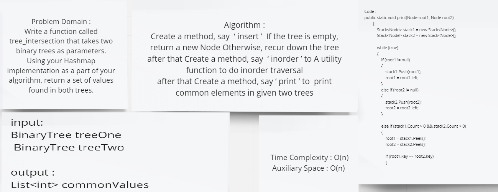

# Challenge Summary
Write a function called tree_intersection that takes two binary trees as parameters.
Using your Hashmap implementation as a part of your algorithm, return a set of values found in both trees.

## Whiteboard Process

## Approach & Efficiency
| | Time | Space |
|:-- | :----------- | :----------- |
| TreeIntersection() | O(n^2) | O(n) |

## Solution
```c#
 public static void print(Node root1, Node root2)
        {
            Stack<Node> stack1 = new Stack<Node>();
            Stack<Node> stack2 = new Stack<Node>();

            while (true)
            {
                if (root1 != null)
                {
                    stack1.Push(root1);
                    root1 = root1.left;
                }
                else if (root2 != null)
                {
                    stack2.Push(root2);
                    root2 = root2.left;
                }

                else if (stack1.Count > 0 && stack2.Count > 0)
                {
                    root1 = stack1.Peek();
                    root2 = stack2.Peek();

                    if (root1.key == root2.key)
                    {
                        Console.Write(root1.key + " ");
                        stack1.Pop();
                        stack2.Pop();
                        root1 = root1.right;
                        root2 = root2.right;
                    }

                    else if (root1.key < root2.key)
                    {
                       
                        stack1.Pop();
                        root1 = root1.right;
                        root2 = null;
                    }
                    else if (root1.key > root2.key)
                    {
                        stack2.Pop();
                        root2 = root2.right;
                        root1 = null;
                    }
                }
                else
                {
                    break;
                }
                
            }
        }
        public static Node newNode(int ele)
        {
            Node temp = new Node();
            temp.key = ele;
            temp.left = null;
            temp.right = null;
            return temp;
        }
        public static void inorder(Node root)
        {
            if (root != null)
            {
                inorder(root.left);
                Console.Write(root.key + " ");
                inorder(root.right);
            }
        }
        public static Node insert(Node node, int key)
        {
            
            if (node == null)
            {
                return newNode(key);
            }
            if (key < node.key)
            {
                node.left = insert(node.left, key);
            }
            else if (key > node.key)
            {
                node.right = insert(node.right, key);
            }
            return node;
        }


```