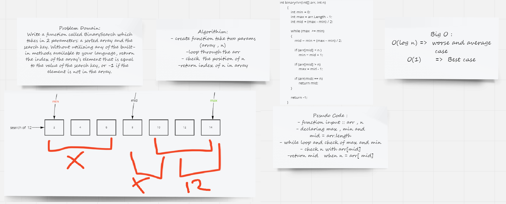

## array binary search
>Write a function called BinarySearch which takes in 2 parameters: a sorted array and the search key. Without utilizing any of the built-in methods available to your language, return the index of the array’s element that is equal to the value of the search key, or -1 if the element is not in the array.

## Approach & Efficiency :
* I search on mid if n insid min or max finally i return n 
* If n is not insid arr i return -1
