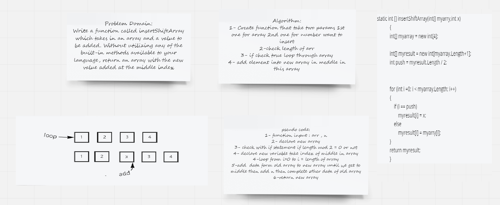

## array insert shift

> Write a function called insertShiftArray which takes in an array and a value to be added. Without utilizing any of the built-in methods available to your language, return an array with the new value added at the middle index.

## Approach & Efficiency :
* decler 2 array one is the origenal and two is the insert  
* loop over array if it in the midpoint insert the new index

