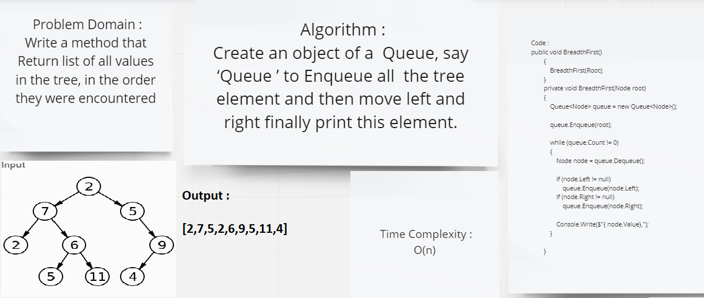

#  breadth first

## Challenge Summary
Write a function called breadth first To Return list of all values in the tree, in the order they were encountered

## Whiteboard Process



## Approach & Efficiency
Time Complexity :
O(n)

## Solution
```
public void BreadthFirst()
        {
            BreadthFirst(Root);
        }
        private void BreadthFirst(Node root)
        {
            Queue<Node> queue = new Queue<Node>();

            queue.Enqueue(root);

            while (queue.Count != 0)
            {
                Node node = queue.Dequeue();

                if (node.Left != null)
                    queue.Enqueue(node.Left);
                if (node.Right != null)
                    queue.Enqueue(node.Right);

                Console.Write($"{ node.Value},");
            }

        }
```