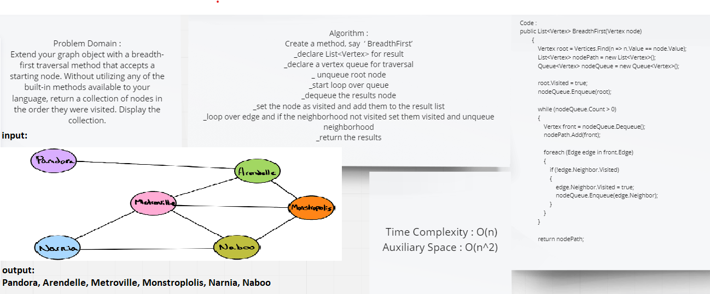

# Challenge Summary
Extend your graph object with a breadth-first traversal method that accepts a starting node. Without utilizing any of the built-in methods available to your language, return a collection of nodes in the order they were visited. Display the collection.

## Whiteboard Process


## Approach & Efficiency
* Big O Space = O(n)
* Big O Time = O(n^2)
## Solution
```c#
public List<Vertex> BreadthFirst(Vertex node)
        {
            Vertex root = Vertices.Find(n => n.Value == node.Value);
            List<Vertex> nodePath = new List<Vertex>();
            Queue<Vertex> nodeQueue = new Queue<Vertex>();

            root.Visited = true;
            nodeQueue.Enqueue(root);

            while (nodeQueue.Count > 0)
            {
                Vertex front = nodeQueue.Dequeue();
                nodePath.Add(front);

                foreach (Edge edge in front.Edge)
                {
                    if (!edge.Neighbor.Visited)
                    {
                        edge.Neighbor.Visited = true;
                        nodeQueue.Enqueue(edge.Neighbor);
                    }
                }
            }

            return nodePath;
        }
```
