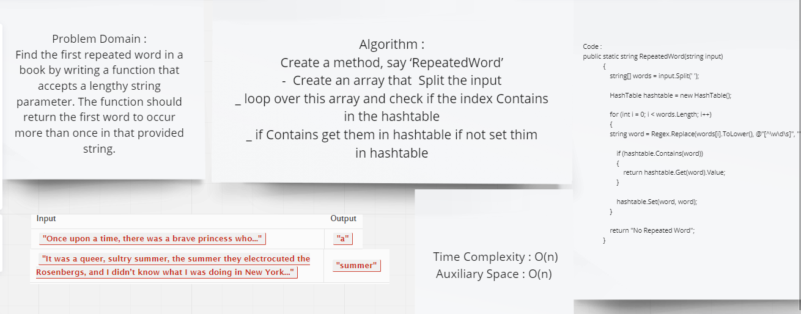

# Challenge Summary
Find the first repeated word in a book by writing a function that accepts a lengthy string parameter. The function should return the first word to occur more than once in that provided string.

## Whiteboard Process



## Approach & Efficiency


| | Time | Space |
|:-- | :----------- | :----------- |
| RepeatedWord | O(n) | O(n) |
## Solution

```c#
 public static string RepeatedWord(string input)
            {
                string[] words = input.Split(' ');

                HashTable hashtable = new HashTable();

                for (int i = 0; i < words.Length; i++)
                {
                string word = Regex.Replace(words[i].ToLower(), @"[^\w\d\s]", "");

                    if (hashtable.Contains(word))
                    {
                        return hashtable.Get(word).Value;
                    }

                    hashtable.Set(word, word);
                }

                return "No Repeated Word";
            }
```            