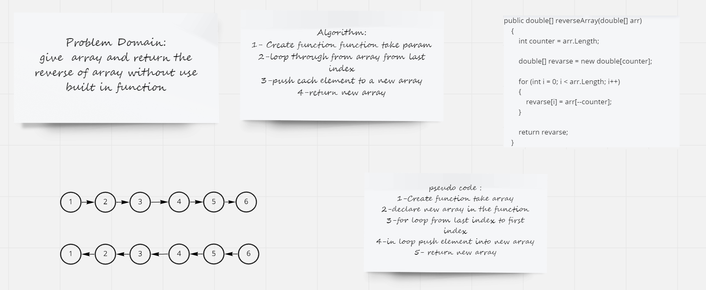

## array-reverse
>Write a function called reverseArray which takes an array as an argument. Without utilizing any of the ?built-in methods available to your language, return an array with elements in reversed order.

## Approach & Efficiency :
I create an empty array and `loop` over the original array `finally` add the elements to the revers array
